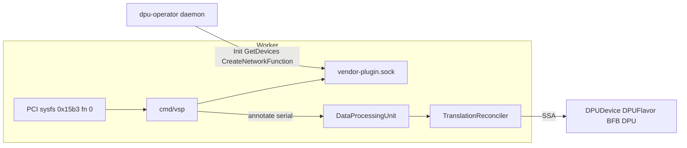

# opi-nvidia-dpf-adapter

Companion operator that translates OPI cluster objects into NVIDIA DPF
objects. NVIDIA-specific code lives **here**, not in-tree in
[`opiproject/dpu-operator`](https://github.com/opiproject/dpu-operator)
(OpenShift downstream: [`openshift/dpu-operator`](https://github.com/openshift/dpu-operator)).

This is the Kubernetes analogue of
[`opi-nvidia-bridge`](https://github.com/opiproject/opi-nvidia-bridge):
vendor knowledge is a sidecar to upstream, not a fork of it.

```
OPI DataProcessingUnit   --FieldMapping YAML-->  DPUDevice + DPUFlavor + BFB + DPU
OPI ServiceFunctionChain --FieldMapping YAML-->  DPUService (one per Helm chart NF)
```

Upstream OPI CRDs come from `opiproject/dpu-operator`. Downstream DPF
CRDs come from [`NVIDIA/doca-platform`](https://github.com/NVIDIA/doca-platform).
This repo owns neither API. It watches unstructured objects and applies
unstructured objects.

## Why a companion repo

The OPI DPU Operator is vendor-neutral. Intel and Marvell Vendor-Specific
Plugins (VSPs) already live in-tree as gRPC servers the node daemon
dials. NVIDIA DPF is a different control plane: provisioning is
declarative CRDs (`DPU`, `DPUService`, Helm charts), not an imperative
`CreateNetworkFunction` implementation inside the daemon.

Putting NVIDIA field copies and BlueField PCI scans into
`dpu-operator` would:

- encode one vendor's object model in the shared operator
- force every OPI→DPF schema change through that repo's review
- break the TSC rule that OPI stays hardware-agnostic

The adapter therefore has two processes:

| Binary | Role |
|---|---|
| `cmd/main.go` | Cluster translator. Loads `config/mappings/*.yaml`, watches OPI GVKs, SSA-applies DPF GVKs. |
| `cmd/vsp` | Node plugin. Enumerates BlueField hardware, annotates `DataProcessingUnit`, serves the daemon's unix-socket gRPC. |

No `switch obj.GetKind()`. No imported OPI or DPF Go structs in the
translator. GVKs are registered with `scheme.AddKnownTypeWithName` on
`unstructured.Unstructured`, the same trick the fake-client tests use.

## Translation engine

The mapping is **data**. `TranslationReconciler` is generic: it takes a
`mapping.Spec`, `Get`s the source object, calls `mapping.Apply`, and
applies each emitted object with server-side apply
(`client.ApplyConfigurationFromUnstructured`).

Concrete documents:

| File | Watches | Emits |
|---|---|---|
| [`config/mappings/dataprocessingunit.yaml`](config/mappings/dataprocessingunit.yaml) | `config.openshift.io/v1 DataProcessingUnit` | `DPUDevice`, `DPUFlavor`, `BFB`, `DPU` |
| [`config/mappings/servicefunctionchain.yaml`](config/mappings/servicefunctionchain.yaml) | `config.openshift.io/v1 ServiceFunctionChain` | `DPUService` per `networkFunctions[].chart` |

Each field is exactly one of:

- `from` — dotted JSONPath (`spec.nodeName` → `spec.dpuNodeName`)
- `cel` — CEL over `source` and `item` (`'chart' in item`, annotation keys with `/`)
- `value` — literal (DPF-required fields OPI does not have, e.g. `spec.nodeEffect.noEffect: true`)

`forEach` + `when` is how one ServiceFunctionChain becomes N DPUServices
and how a bare `image` NF is skipped (DPF has no field for a raw
container image). Image-versus-chart is an OPI API upgrade
([`opiproject/dpu-operator#6`](https://github.com/opiproject/dpu-operator/pull/6));
the YAML is the NVIDIA consumer of that `HelmChartSource`.

Schema and rules for what Go may not do:
[docs/mapping-spec.md](docs/mapping-spec.md).

```sh
go test ./pkg/mapping/ ./internal/controller/ -count=1
```

The controller tests use `client/fake` plus unstructured GVK
registration. They load the real mapping YAML and assert a chart NF
emits `spec.helmChart.source.repoURL` / `version`, while an image-only
NF yields `NotFound`.

## Vendor-Specific Plugin

Intel/Marvell VSPs **are** the source of truth the in-tree daemon
consumes over a unix socket. This translator is **not**. It only reads
annotations on the OPI `DataProcessingUnit`:

- `provisioning.dpu.nvidia.com/serial-number`
- `dpu.nvidia.com/bfb-url`

`cmd/vsp` is the missing link. It enumerates hardware (mock flags on
kind, sysfs PCI on a worker) and patches those annotations. The mapping
YAML then copies them into DPF `serialNumber` / BFB URL. Serials are
never invented in Go.



One listener multiplexes:

- `opi_api.lifecycle.v1alpha1` LifeCycle/DeviceService — what
  `GrpcPlugin` currently dials for `Init` / `GetDevices`
- `Vendor.*` LifeCycle/Device/NetworkFunction/Heartbeat — dpu-api,
  including `CreateNetworkFunction` / `DeleteNetworkFunction`

There is no protoc in this repo. Stubs are imported
(`github.com/openshift/dpu-operator/dpu-api` with a replace to
`opiproject/dpu-operator`, and the lifecycle module with a replace to
the same nested-module commit the daemon uses).

`CreateNetworkFunction` is a successful no-op. The daemon CNI path
sends two MAC addresses; NVIDIA chain members are `DPUService` Helm
charts from the mapping file. Returning `Empty` keeps the daemon
healthy without imperative provisioning.

PCI enumerator: vendor `0x15b3`, function `0` only. Serial from sysfs
`serial`, else VPD keyword `SN`, else PCIe Device Serial Number in
`config`. Lab commands: [docs/vsp.md](docs/vsp.md).

Local mock (no BlueField):

```sh
go run ./cmd/vsp --metrics-bind-address=0 \
  --node-name=kind-worker \
  --serial-number=MT25066004A1 \
  --bfb-url=https://example.invalid/fw.bfb
```

gRPC only, no kubeconfig (macOS cannot bind `/var/run`):

```sh
go run ./cmd/vsp --grpc-only --serial-number=MT25066004A1 \
  --grpc-socket=/tmp/vendor-plugin.sock
grpcurl -plaintext unix:///tmp/vendor-plugin.sock list
```

On a worker with a BlueField (needs root, no cluster):

```sh
sudo ./vsp --pci --grpc-only --node-name="$(hostname)"
```

`--pci` without `--grpc-only` still calls `GetConfigOrDie`.

## Quick start

Prerequisites: Go 1.26+, Docker, kubectl, a cluster that already has
the OPI and DPF CRDs.

```sh
# Translator against an existing cluster
go run ./cmd/main.go --mapping-dir=config/mappings --metrics-bind-address=0

# Sample DPU with no serial; the VSP stamps it
kubectl apply -f config/samples/dataprocessingunit.yaml
```

Deploy from an image:

```sh
make docker-build docker-push IMG=<registry>/opi-nvidia-dpf-adapter:<tag>
make deploy IMG=<registry>/opi-nvidia-dpf-adapter:<tag>
```

This adapter does not install OPI or DPF CRDs (`make install` is a
no-op for APIs this repo does not own).

## Tests

| Command | What it proves |
|---|---|
| `go test ./pkg/mapping/` | CEL/JSONPath interpreter + real mapping files |
| `go test ./pkg/discovery/` | PCI enumerator against mocked sysfs |
| `go test ./pkg/vsp/` | GetDevices, opi-api handshake, NetworkFunction ack |
| `go test ./internal/controller/` | Fake-client SFC chart vs image skip |
| `make test-e2e` | Kind: CRDs, mock VSP, DPU→DPUDevice, SFC→DPUService |

`make test-e2e` creates a kind cluster, installs the vendored OPI and DPF CRDs from `test/e2e/crds/`, deploys the translator plus a mock VSP (`--serial-number` / `--bfb-url` from env), applies a `DataProcessingUnit` and a Helm-chart `ServiceFunctionChain`, and waits until `DPUDevice` and `DPUService` exist.

## Status

Phase 0 software for the companion adapter is in place. Physical
BlueField handshake (`lspci` / sysfs / daemon `Init`) waits on lab
SSH. Helm `NetworkFunction.chart` is proposed upstream in
[opiproject/dpu-operator#6](https://github.com/opiproject/dpu-operator/pull/6).

## License

Copyright 2026 Kartikey Gupta.

Licensed under the Apache License, Version 2.0 (the "License");
you may not use this file except in compliance with the License.
You may obtain a copy of the License at

    http://www.apache.org/licenses/LICENSE-2.0

Unless required by applicable law or agreed to in writing, software
distributed under the License is distributed on an "AS IS" BASIS,
WITHOUT WARRANTIES OR CONDITIONS OF ANY KIND, either express or implied.
See the License for the specific language governing permissions and
limitations under the License.
